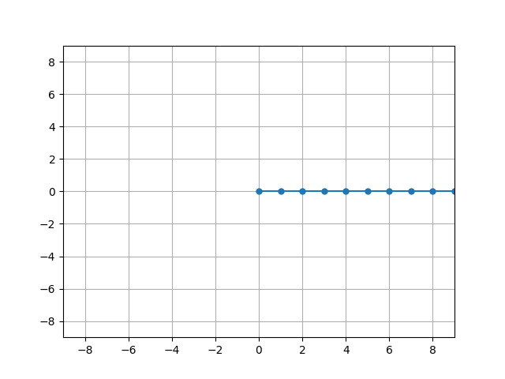

# Monte Carlo Importance Sampling of HP Model Proteins on a 2D Square Lattice.

This project implements enumeration and Monte Carlo sampling of **self‑avoiding walks (SAWs)** on a 2D square lattice to model simplified protein conformations under the **HP (Hydrophobic/Polar) model**. In this model, a protein’s sequence of hydrophobic (H) and polar (P) residues folds into conformations that avoid self‑intersection.

---

## Features

* Complete enumeration of self‑avoiding walks of a given length
* Graph representation of conformations (lattice positions + neighbor connectivity)
* HP sequence assignment to lattice graphs
* Topological contact statistics, including:

  * H–H contacts
  * H–P contacts
  * P–P contacts
* Monte Carlo importance sampling tools for approximate ensemble statistics
* Computation of partition functions and ensemble averages 

---

## Repository Structure

The `src` folder contains all script files (`setup.py`, `mc.py`, `node.py`, `seq.py`, `data.py`). The files `setup.py`, `mc.py`, and `node.py` provide most of the groundwork for the simulations. Graphs are generated in `data.py`. 

The `figures` folder contains example plots generated with the functions in the `data.py` file. If you want to save files to the folder change the path name at the top the file:

```python
# Folder location for saving plots (replace)
path_root = '/Users/xxxx/Documents/GitHub/StatMechProject/figures/'
```

---

This project requires Python 3.8+ and the following libraries:

* numpy
* matplotlib

Install them with:

```
pip install numpy matplotlib
```

---

### Generate all conformations of length *n*

```python
from setup import *

# Generate all SAWs of length 10 (all‑H sequence as an example)
ensemble = generateCons(10, [0]*10)
```

### Display a conformation

```python

displayConformation(ensemble[0])
```


### Compute ensemble statistics

```python

z, freq, max_contacts = calcZ(ensemble, 2)
avg_m = calcAvgM(ensemble, 2)

print("Partition function Z:", z)
print("Average H–H contacts:", avg_m)
```

```
Partition function Z: 1048.6889789538795
Average H–H contacts: 3.657694787609913
```

---

## Available Analysis Tools

| Function                       | Description                   |
| ------------------------------ | ----------------------------- |
| `findTopolHHNeighbors(graph)`  | Count non‑bonded H–H contacts |
| `findTopolHPNeighbors(graph)`  | Count H–P contacts            |
| `findTopolPPNeighbors(graph)`  | Count P–P contacts            |
| `findAllTopolNeighbors(graph)` | Combined contact counts       |
| `calcZ(ensemble, e)`           | Partition function            |
| `calcAvgP(ensemble, e)`        | Average compactness           |
| `calcNativeP(ensemble)`        | Average Native state compactness    |
| `calcAvgM(ensemble, e)`        | Average H–H contacts          |

---

## Notes

* Enumeration of SAWs grows exponentially with chain length; exact enumeration becomes expensive beyond ~12–15 residues.
* Expectation values from Monte Carlo ensem

---

## References

* Lau, K. F. & Dill, K. A. (1989). *A lattice statistical mechanics model of the conformational and sequence spaces of proteins*. Macromolecules.


